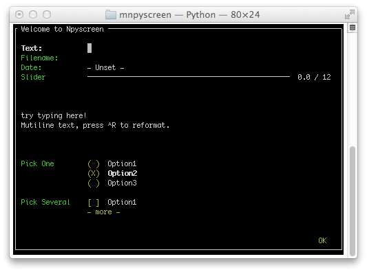

An introduction to npyscreen
============================

*'Writing user interfaces without all that mucking about in hyperspace'*

Purpose
-------

Npyscreen is a python widget library and application framework for programming terminal or console applications. It is built on top of ncurses, which is part of the standard library.  

Wouldn't it be really nice if asking the user to give you some information could be easy? As easy as::

	MyForm = Form()
	
	usrn_box = MyForm.add_widget(TitleText, name="Your name:")
	internet = MyForm.add_widget(TitleText, name="Your favourite internet page:")
	
	MyForm.edit()
	
	# usrn_box.value and internet.value now hold the user's answers.

If you think so, this library is for you.

Example Code
------------

This is an example of a simple, one-screen application.  More advanced applications would use the NPSAppManaged framework::

	#!/usr/bin/env python
	# encoding: utf-8
	
	import npyscreen
	class TestApp(npyscreen.NPSApp):
	    def main(self):
	        # These lines create the form and populate it with widgets.
	        # A fairly complex screen in only 8 or so lines of code - a line for each control.
	        F  = npyscreen.Form(name = "Welcome to Npyscreen",)
	        t  = F.add(npyscreen.TitleText, name = "Text:",)
	        fn = F.add(npyscreen.TitleFilename, name = "Filename:")
	        fn2 = F.add(npyscreen.TitleFilenameCombo, name="Filename2:")
	        dt = F.add(npyscreen.TitleDateCombo, name = "Date:")
	        s  = F.add(npyscreen.TitleSlider, out_of=12, name = "Slider")
	        ml = F.add(npyscreen.MultiLineEdit, 
	               value = """try typing here!\nMutiline text, press ^R to reformat.\n""", 
	               max_height=5, rely=9)
	        ms = F.add(npyscreen.TitleSelectOne, max_height=4, value = [1,], name="Pick One", 
	                values = ["Option1","Option2","Option3"], scroll_exit=True)
	        ms2= F.add(npyscreen.TitleMultiSelect, max_height =-2, value = [1,], name="Pick Several", 
	                values = ["Option1","Option2","Option3"], scroll_exit=True)
        
	        # This lets the user interact with the Form.
	        F.edit()

	        print(ms.get_selected_objects())

	if __name__ == "__main__":
	    App = TestApp()
	    App.run()   

Strengths
---------

This framework should be powerful enough to create everything from quick, simple programs to complex, multi-screen applications. It is designed to make doing the simple tasks very quick and to take much of the pain out of writing larger applications.

There is a very wide variety of default widgets - everything from simple text fields to more complex tree and grid views.

The focus of this library has always been to provide a rapid way to develop console applications.  In general adding a control to the screen requires only one line of code.

Weaknesses
----------

Version 2.0pre88 introduces the ability of Forms to resize themselves when
the terminal size changes.  Previous versions had always assumed a
fixed-sized terminal. 

Compatibility
-------------

Current development is done on Python 3, but the code is kept compatible with modern releases of Python 2.  Certain features related to unicode work better under Python 3.

It is designed to run using only the python standard library, and the only requirements are a working python (2.4 or above) installation and a working curses library.  Npyscreen will therefore work on almost all common platforms, and even in the Cygwin environment on Windows.

Python 3.4.0
------------

There is a catastrophic bug in the Python curses module in 3.4.0: http://bugs.python.org/issue21088

This bug is fixed in Python 3.4.1, and I was not alerted to it until 3.4.1 was already out.  I do not propose to release a workaround within npyscreen because I think the number of people who are stuck using Python 3.4.0 is very small.  If this causes a problem for you, please get in touch.

Unicode
-------

From version 2.0pre47 onwards all text widgets should now support utf-8 text display and entry on utf-8 capable terminals. This fixes a long-standing limitation with the library, and makes it suitable for use in projects targeting non-English-speaking users.

As of version 2.0pre48 the library aims to be robust in dealing with unicode across all widgets. There are still a few places in the system where support for utf-8/unicode needs further work. Please file bug reports if you encounter them.

Similar Projects
----------------

You might also like to look at http://excess.org/urwid/ 

Compared to npyscreen, urwid is more like a traditional, event-driven gui library, and targets other display devices as well as curses.

